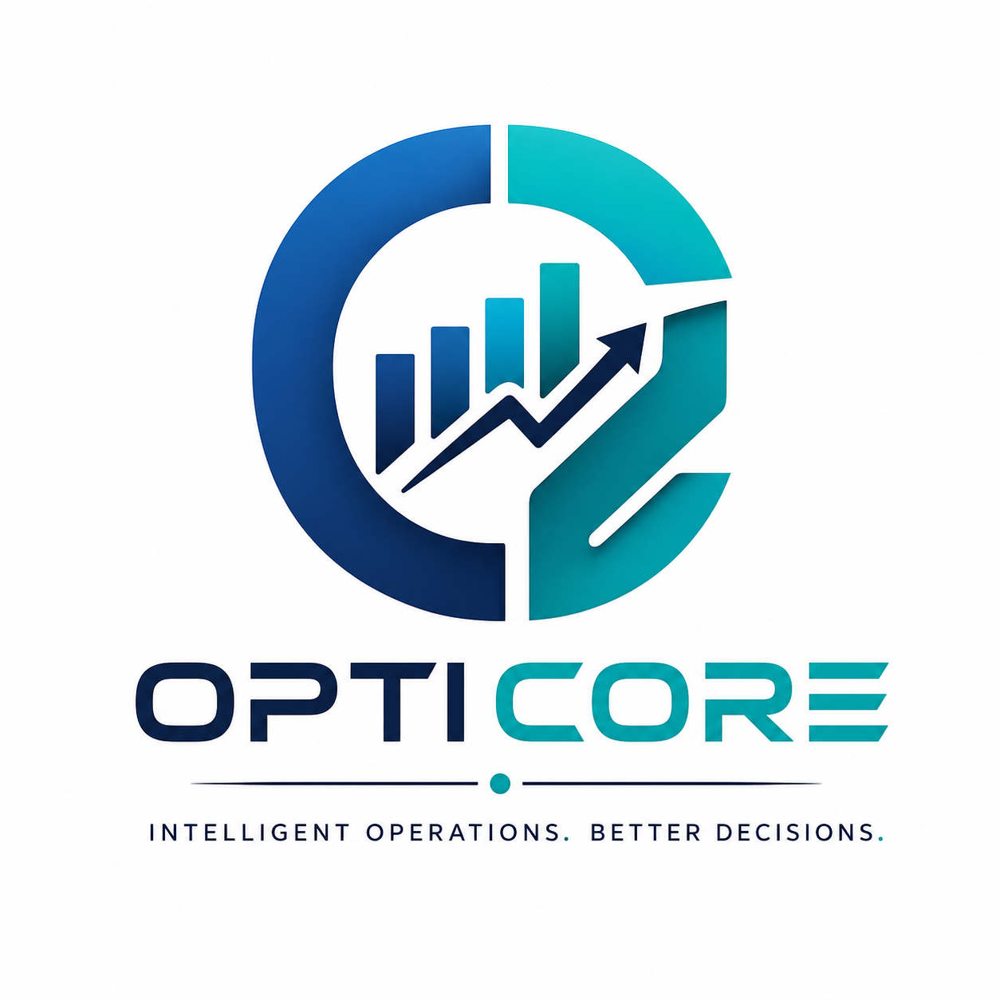

# 🚀 OptiCore – Intelligent Business Operations Platform

<p align="center">
  
</p>

<h3 align="center">
Transforming Operational Data into Intelligent Business Decisions
</h3>

<p align="center">
Upload → Analyze → Detect → Predict → Explain → Recommend → Report
</p>

<p align="center">


</p>


---

# 📖 Overview

**OptiCore** is an AI-powered Business Operations Intelligence Platform designed to help organizations transform raw operational data into meaningful business decisions.

Unlike traditional dashboards that simply visualize metrics, OptiCore provides an end-to-end operational intelligence workflow:

- 📥 Data Ingestion
- 📊 Business Analytics
- 🚨 Automated Problem Detection
- 📈 Predictive Analytics
- 🤖 AI-powered Operational Insights
- 💡 Intelligent Recommendations
- 📄 Executive Report Generation

The platform is designed to simulate how modern organizations monitor operations, optimize workflows, and support strategic decision-making.

---

# 🎯 Problem Statement

Organizations generate massive amounts of operational data every day.

However, most reporting systems only answer:

> **"What happened?"**

Very few systems answer:

- Why did it happen?
- What is likely to happen next?
- What should we do now?

OptiCore bridges this gap by combining business analytics, machine learning, and generative AI into a unified decision-support platform.

---

# ✨ Key Features

## 📥 Data Hub

- CSV Upload
- Excel Upload
- SQL Database Import
- Automatic Data Validation
- Duplicate Detection
- Missing Value Detection
- Data Cleaning
- Dataset Preview
- Data Quality Score

---

## 📊 Business Analytics

Interactive dashboards for:

- Revenue
- Profit
- Orders
- Inventory
- Logistics
- Operations
- Customers
- Suppliers

Key KPIs include:

- Operational Efficiency
- Inventory Health
- Supplier Reliability
- Customer Satisfaction
- SLA Compliance
- Fulfillment Rate

---

## 🚨 Intelligent Problem Detection

Automatically identifies:

- Revenue decline
- Inventory shortages
- Overstock
- Supplier delays
- High return rates
- Operational bottlenecks
- SLA violations
- Customer churn risk

---

## 📈 Predictive Analytics

Machine Learning models predict:

- Future Sales
- Inventory Demand
- Revenue
- Product Demand
- Monthly Orders
- Return Rate

Features:

- Confidence Score
- Trend Projection
- Model Evaluation

---

## 🤖 AI Operations Advisor

Powered by Google Gemini.

Generates:

- Executive Summary
- Weekly Business Report
- Root Cause Analysis
- Inventory Advice
- Sales Insights
- Supplier Recommendations
- Operational Improvement Suggestions

Example:

> Revenue declined by 8% this month due to supplier delays affecting Electronics inventory. The reduced stock availability increased fulfillment time, resulting in a higher return rate and lower customer satisfaction.

---

## 💡 Recommendation Engine

Provides actionable recommendations:

- Restock inventory
- Replace suppliers
- Optimize warehouse workflow
- Improve order fulfillment
- Reduce operational costs
- Increase customer retention

---

## 📄 Executive Reports

Export:

- Excel
- CSV
- PDF

Includes:

- KPIs
- Charts
- AI Summary
- Predictions
- Business Recommendations

---

# 🧠 System Workflow

```text
Upload Data
      │
      ▼
Data Validation
      │
      ▼
Business Analytics
      │
      ▼
Problem Detection
      │
      ▼
Predictive Analytics
      │
      ▼
AI Business Advisor
      │
      ▼
Recommendation Engine
      │
      ▼
Executive Report
```

---

# 🏗 Architecture

```text
                ┌──────────────────────┐
                │     Upload Data      │
                └──────────┬───────────┘
                           │
                           ▼
             ┌──────────────────────────┐
             │ Data Validation & Cleaning│
             └──────────┬───────────────┘
                        │
                        ▼
             ┌──────────────────────────┐
             │ Business Analytics Engine│
             └──────────┬───────────────┘
                        │
         ┌──────────────┴───────────────┐
         ▼                              ▼
 Problem Detection             Predictive Analytics
         │                              │
         └──────────────┬───────────────┘
                        ▼
               AI Operations Advisor
                        │
                        ▼
             Recommendation Engine
                        │
                        ▼
             Executive Report Generator
```

---

# 🛠 Tech Stack

## Frontend

- Streamlit

## Backend

- Python

## Database

- PostgreSQL

## Data Processing

- Pandas
- NumPy

## Machine Learning

- Scikit-learn

## Data Visualization

- Plotly

## AI

- Google Gemini

## Reporting

- OpenPyXL
- ReportLab

## Authentication

- SQLAlchemy
- bcrypt

---

# 📂 Project Structure

```text
OptiCore/
│
├── app.py
├── config.py
├── authentication/
├── analytics/
├── preprocessing/
├── ingestion/
├── prediction/
├── ai/
├── recommendations/
├── reporting/
├── pages/
├── database/
├── components/
├── services/
├── utils/
├── tests/
└── docs/
```

---

# 📊 Core Modules

### Executive Command Center

Monitor:

- Revenue
- Profit
- Orders
- Customer Satisfaction
- Inventory Health
- Supplier Reliability
- Active Alerts

---

### Operations Intelligence

- Order Lifecycle
- Processing Time
- Fulfillment Rate
- SLA Compliance
- Throughput
- Operational Efficiency

---

### Inventory Intelligence

- ABC Analysis
- Inventory Health
- Low Stock Prediction
- Warehouse Utilization
- Inventory Aging
- Dead Stock Detection

---

### Supply Chain Analytics

- Supplier Ranking
- Delivery Reliability
- Lead Time Analysis
- Vendor Comparison
- Delay Analysis

---

### Sales Analytics

- Product Performance
- Region Analysis
- Seasonal Trends
- Revenue Forecast
- Customer Buying Patterns

---

### AI Advisor

Generates:

- Executive Reports
- Root Cause Analysis
- Weekly Summary
- Inventory Suggestions
- Business Insights

---

# 🚀 Installation

Clone the repository

```bash
git clone https://github.com/yourusername/OptiCore.git
```

Move into the project

```bash
cd OptiCore
```

Create a virtual environment

```bash
python -m venv venv
```

Activate

Windows

```bash
venv\Scripts\activate
```

Linux / macOS

```bash
source venv/bin/activate
```

Install packages

```bash
pip install -r requirements.txt
```

Create your environment file

```bash
cp .env.example .env
```

Run

```bash
streamlit run app.py
```

---

# 📈 Future Enhancements

- Real-time Streaming Analytics
- IoT Device Integration
- Multi-warehouse Support
- ERP Integration
- SAP Integration
- Power BI Connector
- Role-Based Dashboards
- Mobile Dashboard
- Natural Language SQL Queries
- LLM-powered Chat Assistant

---

## 📸 Feature Gallery

| Dashboard | Inventory |
|-----------|-----------|
|  |  |

| Operations | AI Advisor |
|-----------|-----------|
|  |  |

| Predictions | Reports |
|-----------|-----------|
|  |  |

---

# 🧪 Testing

```bash
pytest tests/
```

---


# 📜 License

This project is released under the MIT License.

---

# 👨‍💻 Author

**K.N.V Sai Meghana **

Electronics & Communication Engineering  
Business Analytics • AI • Data Science • Software Development

---

## ⭐ If you found this project interesting, consider giving it a star!
